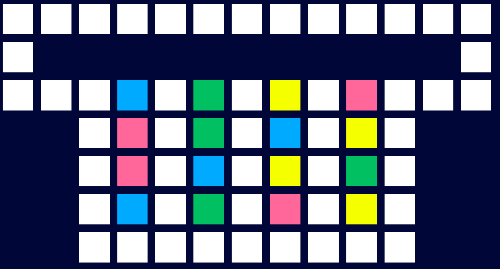

# Solution

Part 1 solved using pen and paper.

---

- Amber amphipods require 1 energy per step
- Bronze amphipods require 10 energy
- Copper amphipods require 100
- Desert ones require 1000.

## Part 1

**Starting position**

```
#############
#...........#
###B#C#A#D###
  #B#C#D#A#
  #########
```

```
#############
#.........D.#
###B#C#A#.###
  #B#C#D#A#
  #########
```
Cost: 2000

```
#############
#A........D.#
###B#C#A#.###
  #B#C#D#.#
  #########
```
Cost: 2011

```
#############
#AA.......D.#
###B#C#.#.###
  #B#C#D#.#
  #########
```
Cost: 2017

```
#############
#AA.........#
###B#C#.#D###
  #B#C#.#D#
  #########
```
Cost 10017

```
#############
#AA.........#
###B#.#.#D###
  #B#C#C#D#
  #########
```
Cost: 10517

```
#############
#AA.........#
###B#.#C#D###
  #B#.#C#D#
  #########
```
Cost: 11017

```
#############
#AA.........#
###.#B#C#D###
  #.#B#C#D#
  #########
```
Cost: 11117

```
#############
#...........#
###A#B#C#D###
  #A#B#C#D#
  #########
```
Cost: 11120

## Part 2




---

### Path with cost:

```
#############
#...........#
###B#C#A#D###
  #D#C#B#A#
  #D#B#A#C#
  #B#C#D#A#
  #########
```
Step 1, cost so far: 8

```
#############
#A..........#
###B#C#.#D###
  #D#C#B#A#
  #D#B#A#C#
  #B#C#D#A#
  #########
```
Step 2, cost so far: 68
```
#############
#A........B.#
###B#C#.#D###
  #D#C#.#A#
  #D#B#A#C#
  #B#C#D#A#
  #########

```
Step 3, cost so far: 77

```
#############
#AA.......B.#
###B#C#.#D###
  #D#C#.#A#
  #D#B#.#C#
  #B#C#D#A#
  #########
```
Step 4, cost so far: 8077
```
#############
#AA.D.....B.#
###B#C#.#D###
  #D#C#.#A#
  #D#B#.#C#
  #B#C#.#A#
  #########
```
Step 5, cost so far: 8377
```
#############
#AA.D.C...B.#
###B#.#.#D###
  #D#C#.#A#
  #D#B#.#C#
  #B#C#.#A#
  #########
```
Step 6, cost so far: 8777
```
#############
#AA.D.....B.#
###B#.#.#D###
  #D#C#.#A#
  #D#B#.#C#
  #B#C#C#A#
  #########
```
Step 7, cost so far: 9177
```
#############
#AA.D.C...B.#
###B#.#.#D###
  #D#.#.#A#
  #D#B#.#C#
  #B#C#C#A#
  #########
```
Step 8, cost so far: 9477
```
#############
#AA.D.....B.#
###B#.#.#D###
  #D#.#.#A#
  #D#B#C#C#
  #B#C#C#A#
  #########
```
Step 9, cost so far: 9547
```
#############
#AA.D...B.B.#
###B#.#.#D###
  #D#.#.#A#
  #D#.#C#C#
  #B#C#C#A#
  #########
```
Step 10, cost so far: 10147
```
#############
#AA.D.C.B.B.#
###B#.#.#D###
  #D#.#.#A#
  #D#.#C#C#
  #B#.#C#A#
  #########
```
Step 11, cost so far: 10347
```
#############
#AA.D...B.B.#
###B#.#.#D###
  #D#.#C#A#
  #D#.#C#C#
  #B#.#C#A#
  #########
```
Step 12, cost so far: 10407
```
#############
#AA.D.....B.#
###B#.#.#D###
  #D#.#C#A#
  #D#.#C#C#
  #B#B#C#A#
  #########
```
Step 13, cost so far: 10477
```
#############
#AA.D.......#
###B#.#.#D###
  #D#.#C#A#
  #D#B#C#C#
  #B#B#C#A#
  #########
```
Step 14, cost so far: 15477
```
#############
#AA.D.D.....#
###B#.#.#.###
  #D#.#C#A#
  #D#B#C#C#
  #B#B#C#A#
  #########
```
Step 15, cost so far: 15482
```
#############
#AA.D.D....A#
###B#.#.#.###
  #D#.#C#.#
  #D#B#C#C#
  #B#B#C#A#
  #########
```
Step 16, cost so far: 15982
```
#############
#AA.D.D.C..A#
###B#.#.#.###
  #D#.#C#.#
  #D#B#C#.#
  #B#B#C#A#
  #########
```
Step 17, cost so far: 15988
```
#############
#AA.D.D.C.AA#
###B#.#.#.###
  #D#.#C#.#
  #D#B#C#.#
  #B#B#C#.#
  #########
```
Step 18, cost so far: 16088
```
#############
#AA.D.D...AA#
###B#.#C#.###
  #D#.#C#.#
  #D#B#C#.#
  #B#B#C#.#
  #########
```
Step 19, cost so far: 22088
```
#############
#AA.D.....AA#
###B#.#C#.###
  #D#.#C#.#
  #D#B#C#.#
  #B#B#C#D#
  #########
```
Step 20, cost so far: 29088
```
#############
#AA.......AA#
###B#.#C#.###
  #D#.#C#.#
  #D#B#C#D#
  #B#B#C#D#
  #########
```
Step 21, cost so far: 29118
```
#############
#AA.B.....AA#
###.#.#C#.###
  #D#.#C#.#
  #D#B#C#D#
  #B#B#C#D#
  #########
```
Step 22, cost so far: 29138
```
#############
#AA.......AA#
###.#.#C#.###
  #D#B#C#.#
  #D#B#C#D#
  #B#B#C#D#
  #########
```
Step 23, cost so far: 37138
```
#############
#AA.....D.AA#
###.#.#C#.###
  #.#B#C#.#
  #D#B#C#D#
  #B#B#C#D#
  #########
```
Step 24, cost so far: 44138
```
#############
#AA...D.D.AA#
###.#.#C#.###
  #.#B#C#.#
  #.#B#C#D#
  #B#B#C#D#
  #########
```
Step 25, cost so far: 44198
```
#############
#AA.B.D.D.AA#
###.#.#C#.###
  #.#B#C#.#
  #.#B#C#D#
  #.#B#C#D#
  #########
```
Step 26, cost so far: 44202
```
#############
#A..B.D.D.AA#
###.#.#C#.###
  #.#B#C#.#
  #.#B#C#D#
  #A#B#C#D#
  #########
```
Step 27, cost so far: 44206
```
#############
#...B.D.D.AA#
###.#.#C#.###
  #.#B#C#.#
  #A#B#C#D#
  #A#B#C#D#
  #########
```
Step 28, cost so far: 44216
```
#############
#.....D.D.AA#
###.#B#C#.###
  #.#B#C#.#
  #A#B#C#D#
  #A#B#C#D#
  #########
```
Step 29, cost so far: 46216
```
#############
#.....D...AA#
###.#B#C#.###
  #.#B#C#D#
  #A#B#C#D#
  #A#B#C#D#
  #########
```
Step 30, cost so far: 49216
```
#############
#.........AA#
###.#B#C#D###
  #.#B#C#D#
  #A#B#C#D#
  #A#B#C#D#
  #########
```
Step 31, cost so far: 49224
```
#############
#..........A#
###.#B#C#D###
  #A#B#C#D#
  #A#B#C#D#
  #A#B#C#D#
  #########
```
Step 32, cost so far: 49232
```
#############
#...........#
###A#B#C#D###
  #A#B#C#D#
  #A#B#C#D#
  #A#B#C#D#
  #########
```
49232